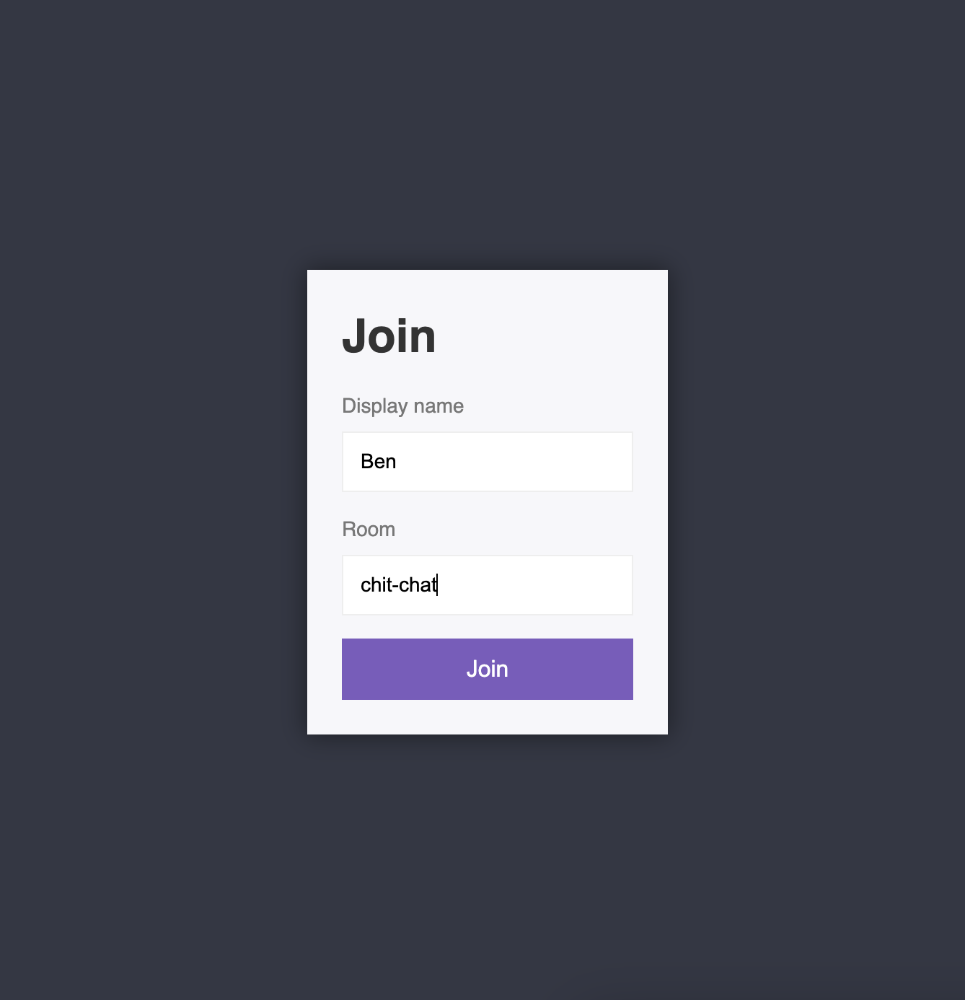

# Chat application

This is a chat application built with node.js and socket.io.

[Live demo](https://chat-app-devs.onrender.com)

In order to run the project locally open `/chat-app` directory in terminal and
type: `npm i` and `npm run dev`. The app in live on localhost 3000

