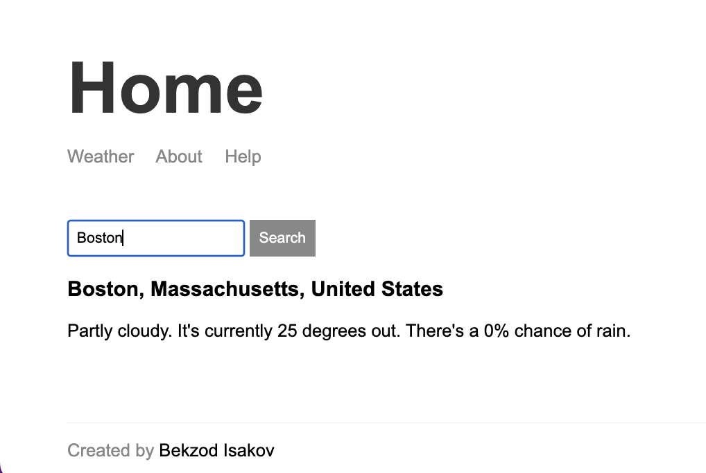

[Live](https://weather-app-express-kqur.onrender.com/)

## Services and dependencies used

- [Live](https://www.mapbox.com) - geocoding
- [Live](https://https://weatherstack.com) - weather forecast
- [Live](https://www.npmjs.com/package/hbs) - view engine

To run the app locally:

1. `npm install` - to intall dependencies
2. `npm run dev` - to start the server
3. The app is live on http://localhost:3000

